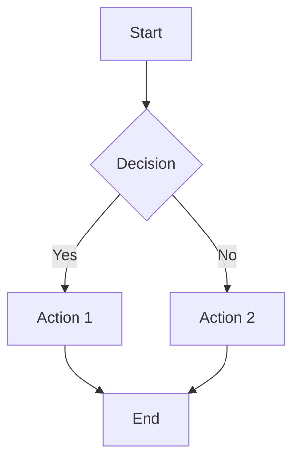
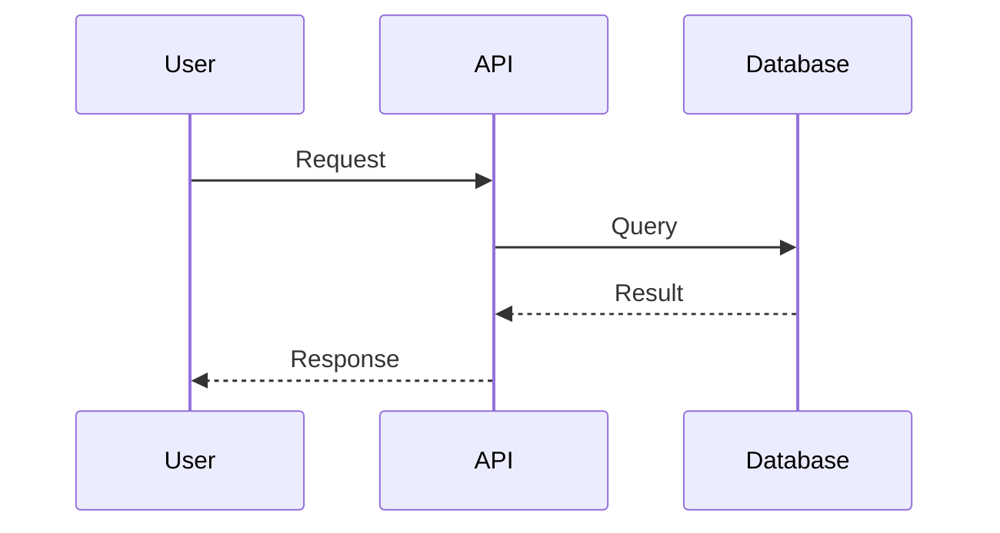

# Documentation Templates

## README.md テンプレート

```markdown
# Project Name

Brief description of what this project does.

## Quick Start

\`\`\`bash
# Installation
npm install

# Development
npm run dev

# Build
npm run build
\`\`\`

## Features

- Feature 1: Description
- Feature 2: Description
- Feature 3: Description

## Usage

\`\`\`typescript
import { something } from 'project-name';

// Example usage
const result = something();
\`\`\`

## Configuration

| Variable | Description | Default |
|----------|-------------|---------|
| `PORT` | Server port | `3000` |
| `NODE_ENV` | Environment | `development` |

## Development

### Prerequisites

- Node.js >= 18
- pnpm >= 8

### Setup

\`\`\`bash
pnpm install
cp .env.example .env
\`\`\`

### Testing

\`\`\`bash
pnpm test
pnpm test:coverage
\`\`\`

## License

MIT
```

---

## API ドキュメントテンプレート

```markdown
# API Reference

## Base URL

\`\`\`
https://api.example.com/v1
\`\`\`

## Authentication

All endpoints require Bearer token authentication.

\`\`\`
Authorization: Bearer <token>
\`\`\`

---

## Endpoints

### GET /users

Retrieve a list of users.

**Query Parameters**

| Name | Type | Required | Description |
|------|------|----------|-------------|
| limit | integer | No | Max results (default: 20) |
| offset | integer | No | Pagination offset |

**Response**

\`\`\`json
{
  "data": [
    {
      "id": "123",
      "name": "John Doe",
      "email": "john@example.com"
    }
  ],
  "meta": {
    "total": 100,
    "limit": 20,
    "offset": 0
  }
}
\`\`\`

**Error Responses**

| Status | Description |
|--------|-------------|
| 401 | Unauthorized |
| 500 | Internal Server Error |
```

---

## JSDoc テンプレート

```typescript
/**
 * Brief description of the function.
 *
 * @description More detailed description if needed.
 *
 * @param {string} param1 - Description of param1
 * @param {Object} options - Configuration options
 * @param {boolean} [options.flag=false] - Optional flag
 * @returns {Promise<Result>} Description of return value
 * @throws {ValidationError} When input is invalid
 *
 * @example
 * const result = await myFunction('value', { flag: true });
 */
```

---

## Mermaid ダイアグラムテンプレート

### フローチャート


### シーケンス図

