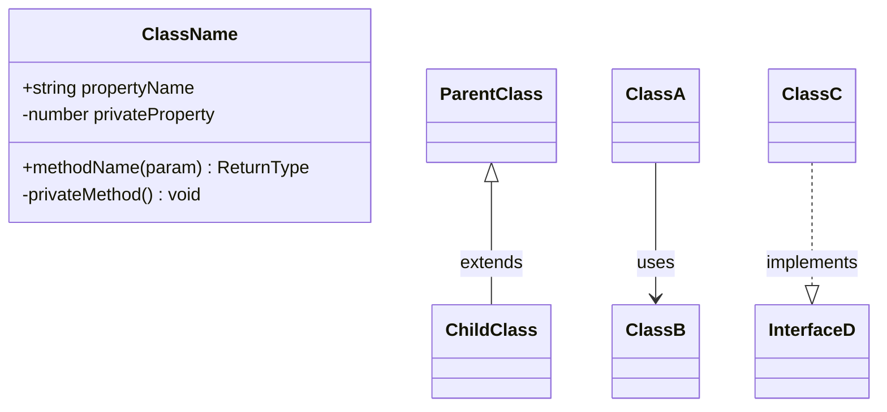
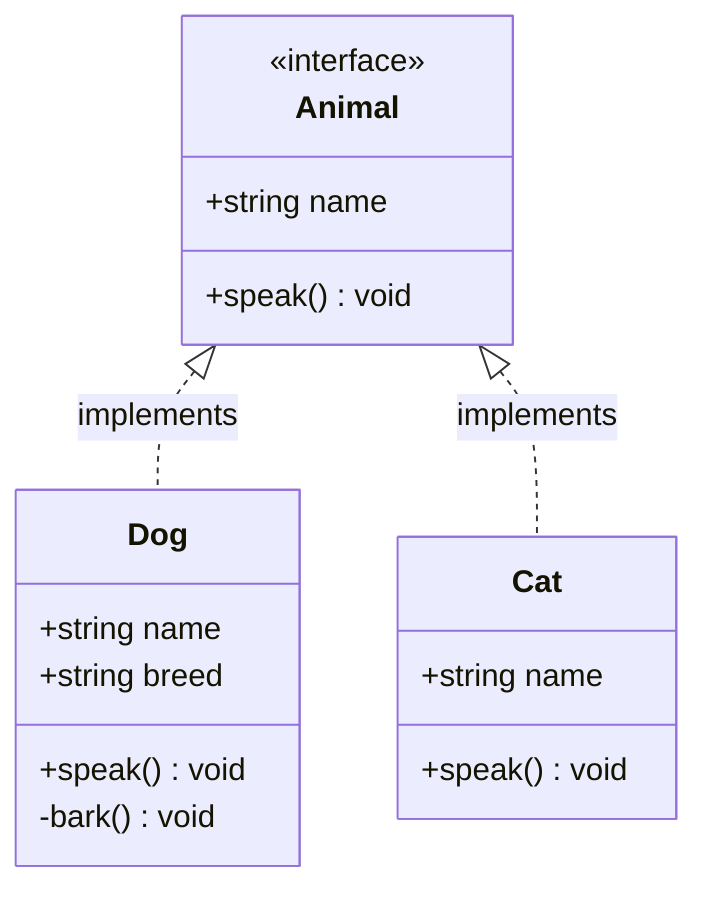
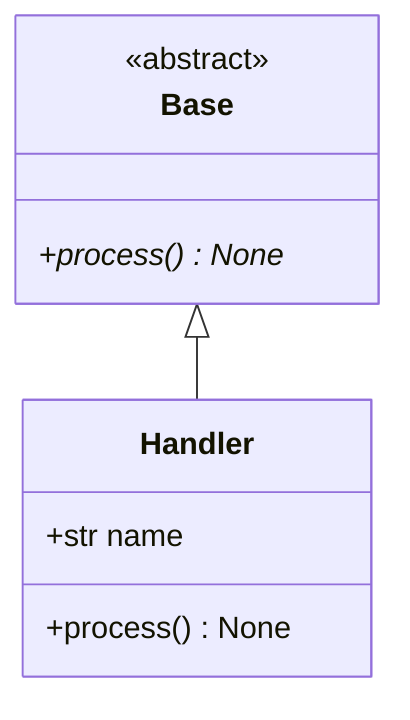
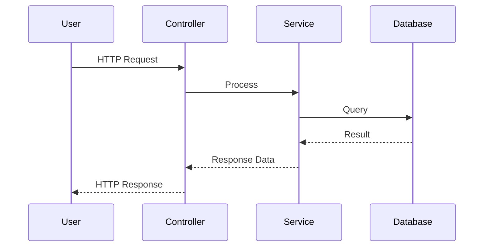
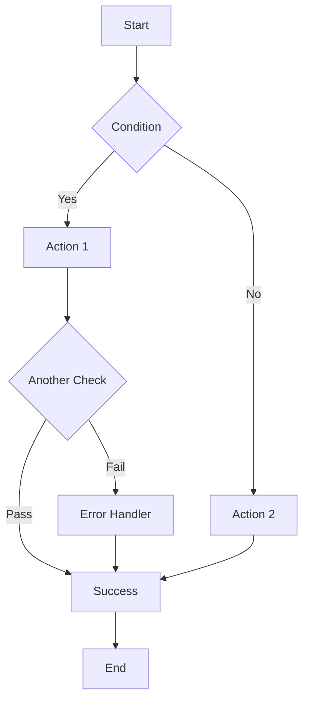
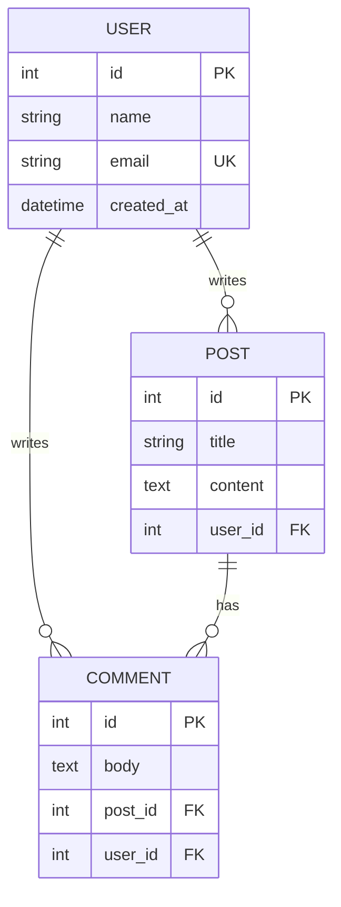
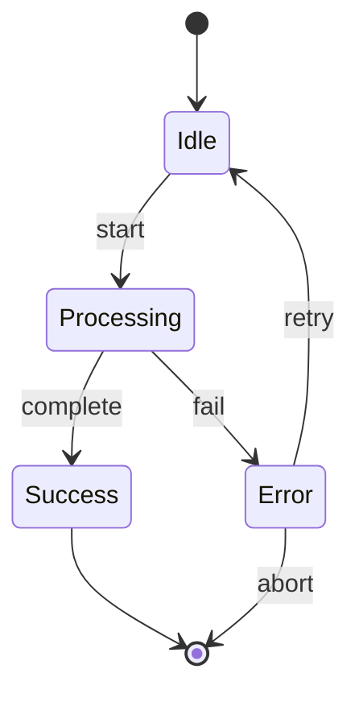
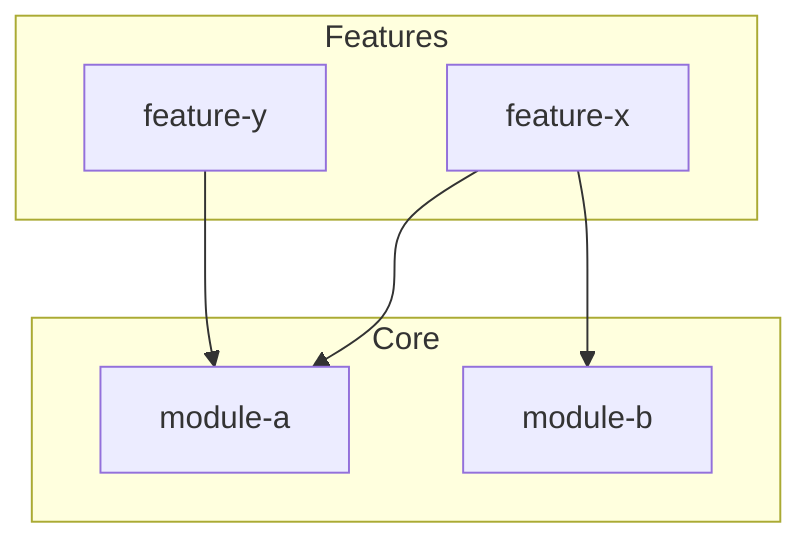

# Diagram Patterns

各図種別のテンプレートと、TypeScript/Python コードからの変換パターン。

## classDiagram

### テンプレート



### TypeScript からの変換

```typescript
// Source
interface Animal {
  name: string;
  speak(): void;
}

class Dog implements Animal {
  name: string;
  breed: string;
  speak(): void {
    /* ... */
  }
  private bark(): void {
    /* ... */
  }
}

class Cat implements Animal {
  name: string;
  speak(): void {
    /* ... */
  }
}
```



### Python からの変換

```python
# Source
class Base(ABC):
    @abstractmethod
    def process(self) -> None: ...

class Handler(Base):
    def __init__(self, name: str):
        self.name = name
    def process(self) -> None: ...
```



## sequenceDiagram

### テンプレート



### 変換のポイント

- `await` / `async` 呼び出し → 非同期メッセージ (`->>`)
- コールバック/戻り値 → 応答メッセージ (`-->>`)
- try/catch → alt/else ブロック
- ループ → loop ブロック

## flowchart

### テンプレート



### 変換のポイント

- `if/else` → 菱形ノード `{}`
- `switch/case` → 複数分岐
- `try/catch` → エラーハンドリングパス
- 関数呼び出し → サブグラフ

## erDiagram

### テンプレート



### 変換のポイント

- Prisma schema / TypeORM Entity → テーブル定義
- `@relation` / `ForeignKey` → リレーション
- カーディナリティ: `||--o{` (1対多), `||--||` (1対1), `}o--o{` (多対多)

## stateDiagram

### テンプレート



### 変換のポイント

- enum/union type の状態 → ステート
- 状態変更関数 → トランジション
- Redux reducer / XState config → 直接マッピング

## graph（依存関係）

### テンプレート



### 変換のポイント

- `import` / `require` → 依存エッジ
- ディレクトリ構造 → サブグラフ
- 循環依存 → 双方向矢印で警告表示
