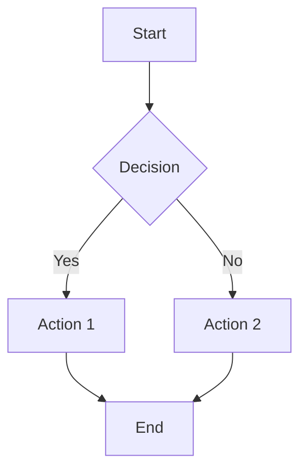
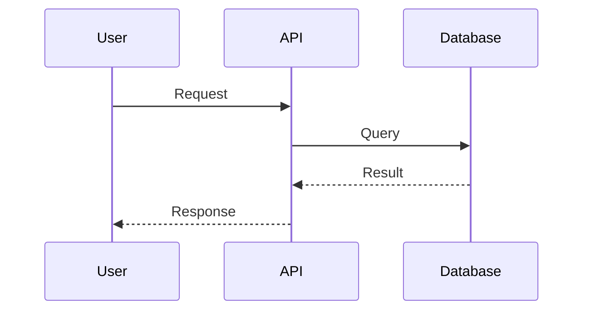
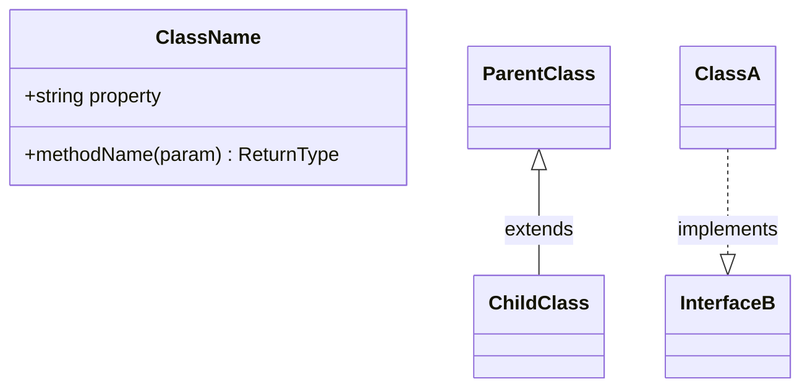
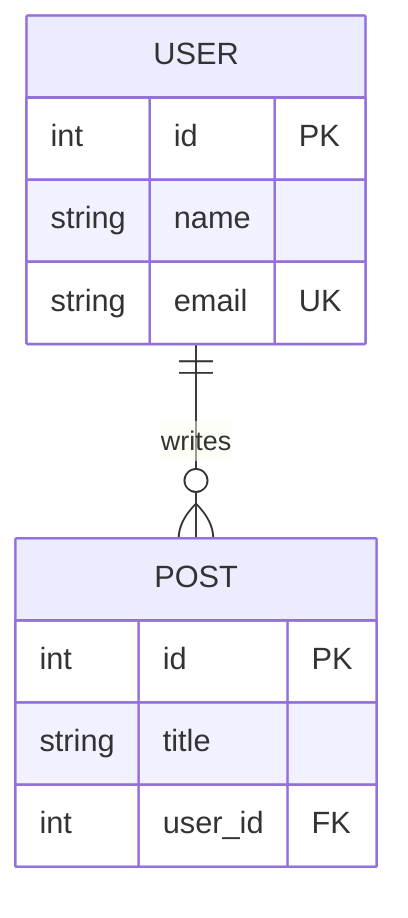
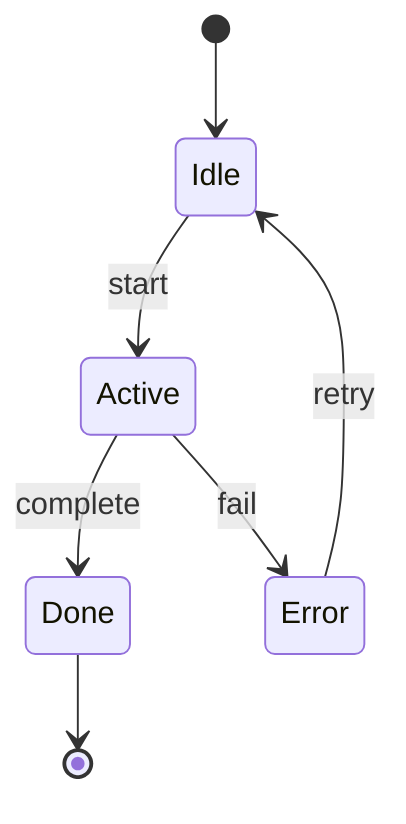

# Mermaid Diagram Templates

## フローチャート

```mermaid
flowchart TD
    A[Start] --> B{Decision}
    B -->|Yes| C[Action 1]
    B -->|No| D[Action 2]
    C --> E[End]
    D --> E
```

## シーケンス図

```mermaid
sequenceDiagram
    participant U as User
    participant A as API
    participant D as Database

    U->>A: Request
    A->>D: Query
    D-->>A: Result
    A-->>U: Response
```

## クラス図

```mermaid
classDiagram
    class ClassName {
        +string property
        +methodName(param) ReturnType
    }
    ParentClass <|-- ChildClass : extends
    ClassA ..|> InterfaceB : implements
```

## ER図

```mermaid
erDiagram
    USER {
        int id PK
        string name
        string email UK
    }
    POST {
        int id PK
        string title
        int user_id FK
    }
    USER ||--o{ POST : writes
```

## 状態遷移図

```mermaid
stateDiagram-v2
    [*] --> Idle
    Idle --> Active : start
    Active --> Done : complete
    Active --> Error : fail
    Error --> Idle : retry
    Done --> [*]
```
